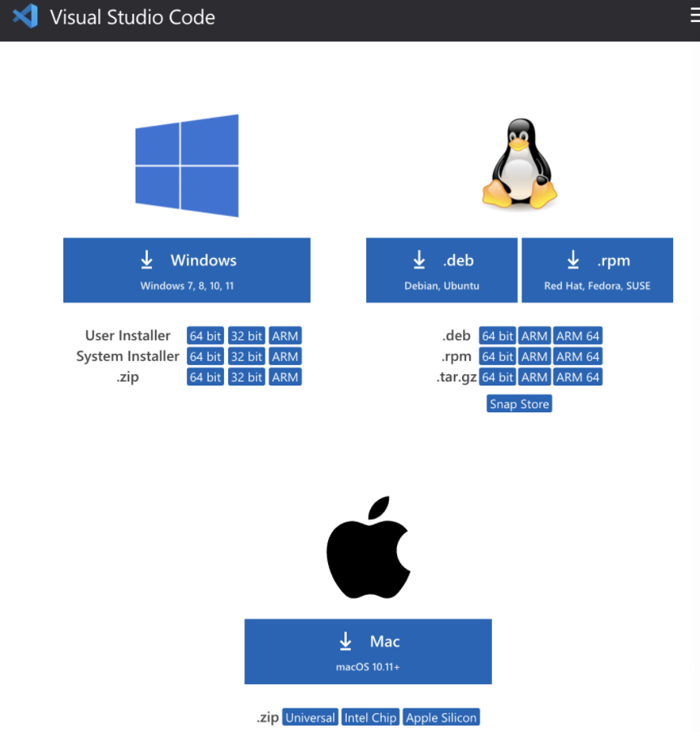
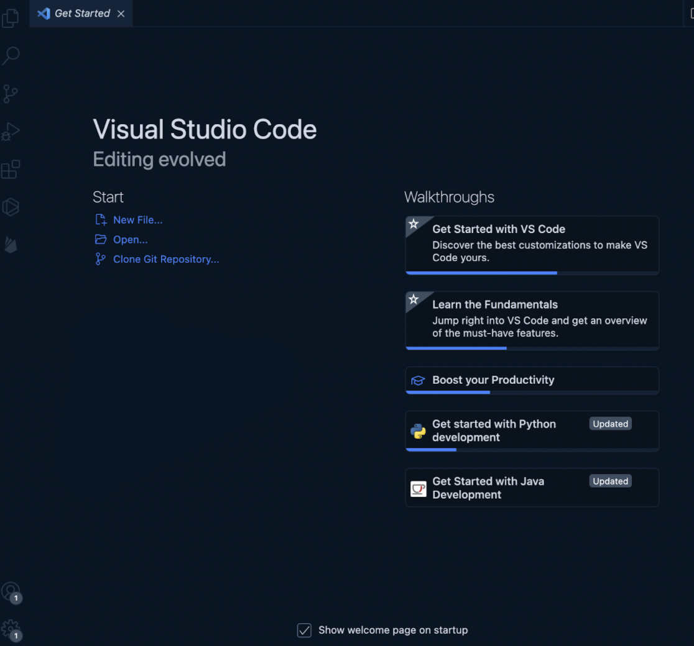
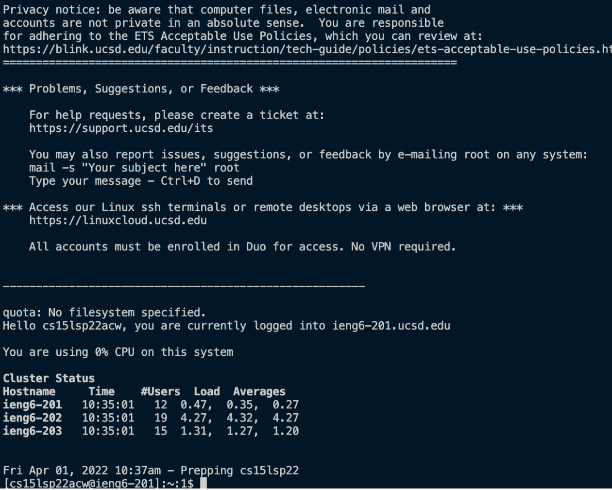

# Installing VS Code
To install VS Code, go to the [VS Code website](https://code.visualstudio.com/download) and click the download button corresponding to your computer. For me, I downloaded the Mac version. 



After following the instructions to install VS Code, opening the IDE should bring you to the ‘welcome’ page, where you can create, edit, or do anything you want with your code.



# Remotely Connecting

We can use the terminal to remotely connect to other computers. VS Code has nicely provided us a terminal we can use that can be accessed by going to “terminal” on the menu and clicking “New Terminal” or pressing ctrl + up + `. Alternatively, one can use the terminal on their computer. 

To remotely connect to another computer, we’ll use a protocol called SSH (Secure Shell), which allows users to access and control remote servers from their local machine. 

In the terminal, I typed 
```sh
$ ssh cs15lsp22acw@ieng6.ucsd.edu
```
to access my CSE 15L account on the `ieng6` remote server after being prompted to type my password. A successful login should look something like this:



# Trying Some Commands
Now that we’re on the remote server, we can try out some fun Linux file management commands to view, navigate, and manage our files on the server (obviously, these commands work on your local machine as well). 

## Useful Commands

`pwd` (print working directory) prints the path to the current directory.

```sh
[cs15lsp22acw@ieng6-203]:~:15$ pwd
/home/linux/ieng6/cs15lsp22/cs15lsp22acw
```

`ls` is used to list the existing files and folders in the current directory.

```sh
[cs15lsp22acw@ieng6-203]:~:16$ ls
WhereAmI.class  WhereAmI.java  perl5
```

`ls -a` shows all files, including hidden files (files starting with “.”).

```sh
[cs15lsp22acw@ieng6-203]:~:33$ ls -a
.   .bash_history  .bashrc  .config  .kshrc  .locallogin  .modulesbegenv  .procmailrc  .ssh       .zshenv  WhereAmI.class  perl5
..  .bash_profile  .cache   .cshrc   .local  .login       .motd 
```

`cd` (change directory) allows you to navigate to the directory specified after `cd`. `cd ..` lets you go back one directory to the parent directory.

```sh
[cs15lsp22acw@ieng6-203]:~:28$ cd perl5
[cs15lsp22acw@ieng6-203]:perl5:29$ ls
[cs15lsp22acw@ieng6-203]:perl5:30$ cd ..
[cs15lsp22acw@ieng6-203]:~:31$ ls
WhereAmI.class  WhereAmI.java  perl5
```

`mkdir` (make directory) is used to create a new directory.

```sh
[cs15lsp22acw@ieng6-203]:~:38$ mkdir test
[cs15lsp22acw@ieng6-203]:~:39$ ls
WhereAmI.class  WhereAmI.java  perl5  test
```

`cat` prints out the contents of a file.

```sh
[cs15lsp22acw@ieng6-203]:~:35$ cat WhereAmI.java
class WhereAmI {
  public static void main(String[] args) {
    System.out.println(System.getProperty("os.name"));
    System.out.println(System.getProperty("user.name"));
    System.out.println(System.getProperty("user.home"));
    System.out.println(System.getProperty("user.dir"));
  }
}
```

# Moving Files with `scp`

`scp` (secure copy) is a command used to securely copy directories and files between two locations, such as your local computer and the remote server.

If I wanted to move a file on my local machine called `WhereAmI.java` to the remote server, I would, on the client/local terminal, do

```sh
$ scp WhereAmI.java cs15lsp22acw@ieng6.ucsd.edu:~/
```

This basically means "copy `WhereAmI.java` to the root directory (`~/`) of `cs15lsp22acw@ieng6.ucsd.edu`". After typing in my password, I successfully copied the file to the remote server.

`WhereAmI.java` prints out information about the system that it is being run on. I know that I successfully copied it to the remote server because running the program prints out different information depending on where I run it.

**Client**
```sh
(base) jenny@Jennys-MacBook-Air-2 cse15l % java WhereAmI
Mac OS X
jenny
/Users/jenny
```

**Remote Server**
```sh
cs15lsp22acw@ieng6-203]:~:37$ java WhereAmI
Linux
cs15lsp22acw
/home/linux/ieng6/cs15lsp22/cs15lsp22acw
/home/linux/ieng6/cs15lsp22/cs15lsp22acw
```

# Setting an SSH Key

So far, every time I log in or run commands like `scp`, I have to type my password, which is quite annoying to do every time. Fortunately, `ssh` keys are a great solution to this and allow one to skip the step of typing in their password every time. 

To set up `ssh` keys, type (on the client)
```sh
$ ssh-keygen
```
Then, enter the file in which to save your key and enter a passphrase, which I left empty for no passphrase.

It should look something like this:

```sh
(base) jenny@Jennys-MacBook-Air-2 Desktop % ssh-keygen
Generating public/private rsa key pair.
Enter file in which to save the key (/Users/jenny/.ssh/id_rsa): /Users/jenny/desktop/delete2
Enter passphrase (empty for no passphrase): 
Enter same passphrase again: 
Your identification has been saved in /Users/jenny/.ssh/id_rsa
Your public key has been saved in /Users/jenny/.ssh/id_rsa.pub
The key fingerprint is:
SHA256:4VjeXVqzHUKDD9PKE9PYk9ZqmfNvee9WBl4EPb3mmtA jenny@Jennys-MacBook-Air-2.local
The key's randomart image is:
+---[RSA 3072]----+
|            *o+o.|
|           B.B.o+|
|        o . O.Ooo|
|       = o = @o*o|
|      . S . *.*o.|
|           . E.oo|
|            . o.+|
|             o .=|
|               +=|
+----[SHA256]-----+
```

This created 2 files, a public key and a private key. We need to copy the public key to the .ssh directory of the remote server account. On the remote server, I typed:

```sh
$ mkdir .ssh
```
Then on the client:

```sh
$ scp /Users/jenny/.ssh/id_rsa.pub cs15lsp22acw@ieng6.ucsd.edu:~/.ssh/authorized_keys
```

Now, you should be able to ssh and scp from the client to the server without typing a password.

```sh
(base) jenny@Jennys-MacBook-Air-2 ~ % ssh cs15lsp22acw@ieng6.ucsd.edu    
quota: No filesystem specified.
Hello cs15lsp22acw, you are currently logged into ieng6-203.ucsd.edu

You are using 0% CPU on this system

Cluster Status 
Hostname     Time    #Users  Load  Averages  
ieng6-201   10:55:01   3  24.46,  24.39,  24.04
ieng6-202   10:55:01   3  0.02,   0.09,   0.23
ieng6-203   10:55:01   3  2.02,   2.15,   2.18
```

# Optimizing Remote Running

There are many ways to make the whole process of ssh and managing files much faster and more efficient.

Here are a few shortcuts:
1. Writing a command in quotes at the end of an ssh command will run that command on the remote server, then exit right after.

```sh
(base) jenny@Jennys-MacBook-Air-2 ~ % ssh cs15lsp22acw@ieng6.ucsd.edu "ls -a"
.
..
.bash_history
.bash_profile
.bashrc
.cache
.config
.cshrc
.kshrc
.local
.locallogin
.login
.modulesbegenv
.motd
perl5
.procmailrc
.profile
.ssh
WhereAmI.class
WhereAmI.java
.zprofile
.zshenv
.zshrc
(base) jenny@Jennys-MacBook-Air-2 ~ % 
```
2. Run multiple commands on the same line by separating each command with a semicolon.

```sh
[cs15lsp22acw@ieng6-203]:~:46$ cd test; mkdir test2; ls; cd ..; ls
test2
WhereAmI.class  WhereAmI.java  perl5  test
```

3. Access previous commands by using the up-arrow.

With these tips, I copied WhereAmI.java from the client to the server using one line and (119 keystrokes w/ enter key)

```sh
$ scp WhereAmI.java cs15lsp22acw@ieng6.ucsd.edu:~/; ssh cs15lsp22acw@ieng6.ucsd.edu "javac WhereAmI.java; java WhereAmI"
```
If I wanted to do it multiple times and the command was already in my history, I can use the up arrow and reduce the number of keystrokes to a minimum of 2 (pressing the up key, then the enter key). This is just a simple way to do it, but there are much faster ways out there to do the same thing! 
