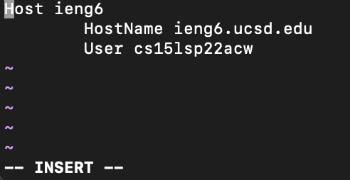

# Streamlining `ssh` Configuration

In `~/.ssh/config`, I added these lines using Vim in the command-line. To edit a file using Vim, I opened Vim using the command `vim ~/.ssh/config`, then typed `i` to insert text. After typing in the lines below, I pressed the escape key, then typed `:wq` to save and exit the file.

```
Host ieng6
	HostName ieng6.ucsd.edu
	User cs15lsp22acw
```


This allows me to access the ieng6 remote server by simply typing `ssh ieng6`.

```
(base) jenny@Jennys-MacBook-Air-2 ~ % ssh ieng6
Last login: Sun May  1 16:07:16 2022 from 128.54.209.194
============================ NOTICE =================================
Authorized use of this system is limited to password-authenticated
usernames which are issued to individuals and are for the sole use of
the person to whom they are issued.

Privacy notice: be aware that computer files, electronic mail and 
accounts are not private in an absolute sense.  You are responsible
for adhering to the ETS Acceptable Use Policies, which you can review at:
https://blink.ucsd.edu/faculty/instruction/tech-guide/policies/ets-acceptable-use-policies.html
=====================================================================

*** Problems, Suggestions, or Feedback ***
    
    For help requests, please create a ticket at:
    https://support.ucsd.edu/its 

    You may also report issues, suggestions, or feedback by e-mailing root on any system:
    mail -s "Your subject here" root
    Type your message - Ctrl+D to send
    
*** Access our Linux ssh terminals or remote desktops via a web browser at: ***
    https://linuxcloud.ucsd.edu

    All accounts must be enrolled in Duo for access. No VPN required.


-------------------------------------------------------

quota: No filesystem specified.
Hello cs15lsp22acw, you are currently logged into ieng6-203.ucsd.edu

You are using 0% CPU on this system

Cluster Status 
Hostname     Time    #Users  Load  Averages  
ieng6-201   11:30:01   14  4.37,   4.37,   4.60
ieng6-202   11:30:01   21  1.24,   0.74,   0.43
ieng6-203   11:30:02   15  16.70,  16.89,  16.63

 
Fri May 06, 2022 11:33am - Prepping cs15lsp22
[cs15lsp22acw@ieng6-203]:~:97$
```

To copy a file from my local machine to the remote server, I typed `scp test-file.md ieng6:~/`. Normally, I would have had to type my username `cs15lsp22zz@ieng6.ucsd.edu` in place of `ieng6`.

```
(base) jenny@Jennys-MacBook-Air-2 markdown-parser % scp test-file.md ieng6:~/
test-file.md                                  100%   64     1.4KB/s   00:00 
```

Using `ls` while logged into the remote server confirms that `test-file.md` was successfully copied over.

```
[cs15lsp22acw@ieng6-203]:~:97$ ls
WhereAmI.class  markdown-parser  skill-demo-2     test
WhereAmI.java   perl5            skill-demo-test  test-file.md
```

# Setting Up Github Access from `ieng6`

This is my public key on Github, which can be found in the "SSH and GPG" section of the Settings menu on Github.


On my local computer, the public key is stored as `~/.ssh/id_rsa.pub`.


My private key is stored in `~/.ssh` as `id_rsa`.


Then, on the remote server, I created a file called `delete-this-file.md` using `touch`, then committed and pushed my changes onto Github.

```
[cs15lsp22acw@ieng6-203]:markdown-parser:105$ touch delete-this-file.md
[cs15lsp22acw@ieng6-203]:markdown-parser:106$ git add .
[cs15lsp22acw@ieng6-203]:markdown-parser:107$ git commit -m "Created delete-this-file.md"
[main e91e5b9] Created delete-this-file.md
 Committer: Jenny Lam <cs15lsp22acw@ieng6-203.ucsd.edu>
Your name and email address were configured automatically based
on your username and hostname. Please check that they are accurate.
You can suppress this message by setting them explicitly. Run the
following command and follow the instructions in your editor to edit
your configuration file:

    git config --global --edit

After doing this, you may fix the identity used for this commit with:

    git commit --amend --reset-author

 1 file changed, 0 insertions(+), 0 deletions(-)
 create mode 100644 delete-this-file.md
[cs15lsp22acw@ieng6-203]:markdown-parser:108$ git push origin main
Username for 'https://github.com': srnq
Password for 'https://srnq@github.com': 
Enumerating objects: 4, done.
Counting objects: 100% (4/4), done.
Delta compression using up to 8 threads
Compressing objects: 100% (2/2), done.
Writing objects: 100% (3/3), 310 bytes | 5.00 KiB/s, done.
Total 3 (delta 1), reused 0 (delta 0), pack-reused 0
remote: Resolving deltas: 100% (1/1), completed with 1 local object.
To https://github.com/srnq/markdown-parser.git
   d014d98..e91e5b9  main -> main
```


