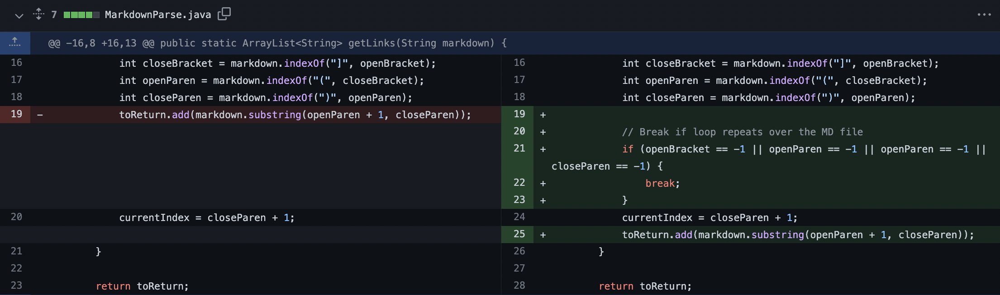
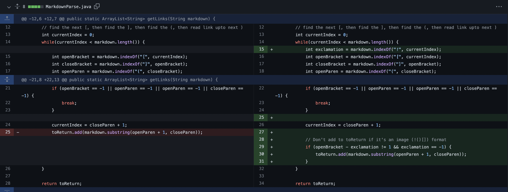
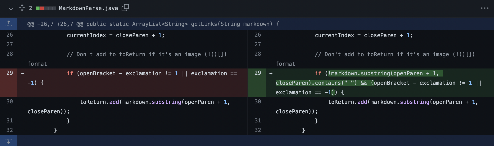

# Problem 1: Text After Last Link



The failure-inducing input was [buggy-test-file.md](https://github.com/srnq/markdown-parser/blob/main/buggy-test-file.md).

Running this file at the command line on the version it failed on gave this output:

```
Exception in thread "main" java.lang.OutOfMemoryError: Java heap space
        at java.base/java.util.Arrays.copyOf(Arrays.java:3512)
        at java.base/java.util.Arrays.copyOf(Arrays.java:3481)
        at java.base/java.util.ArrayList.grow(ArrayList.java:237)
        at java.base/java.util.ArrayList.grow(ArrayList.java:244)
        at java.base/java.util.ArrayList.add(ArrayList.java:454)
        at java.base/java.util.ArrayList.add(ArrayList.java:467)
        at MarkdownParse.getLinks(MarkdownParse.java:19)
        at MarkdownParse.main(MarkdownParse.java:30)
```

In `MarkdownParse.java`, a `while` loop keeps running as long as `currentIndex` is less than the number of characters in the markdown file and `currentIndex` gets updated with `closeParen + 1` each iteration of the loop. Because the failure-inducing input had text after the last link, the last closed parentheses' index will never be greater than the number of total characters in the markdown file, so the loop ever ends (and would cause the indices of the brackets/parentheses to be -1). Because of the infinite loop, the program would run out of memory and it would cause the symptom of the `OutOfMemoryError`. 

# Problem 2: Detecting an Image as a Link



The failure-inducing input was [buggy-test-file-2.md](https://github.com/srnq/markdown-parser/blob/main/buggy-test-file-2.md).

Running this file at the command line on the version it failed on gave this output:

```
[hi.png, 2.html, 3.html]
```

In markdown (and in the failure-inducing input), images have the same format as links, except there is an `!` before the first bracket. The bug is that program does not check whether there is an `!` before the "links", causing images to be detected as links. This caused the symptom of `hi.png` being in the list even though it is an image.

# Problem 3: Detecting Text with Spaces as a Link



The failure-inducing input was [buggy-test-file-3.md](https://github.com/srnq/markdown-parser/blob/main/buggy-test-file-3.md).

Running this file at the command line on the version it failed on gave this output:

```
[website.com, text n]
```

In markdown (and the failure-inducing input), text within the parentheses do not show up as links. However, there is a bug in the program that would add that text to the list of links regardless of whether there are spaces. This caused the symptom of `text n`, text with a space in it, to show up in the list even though it is not a link.
