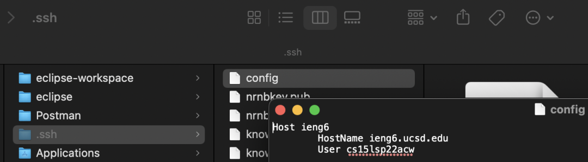
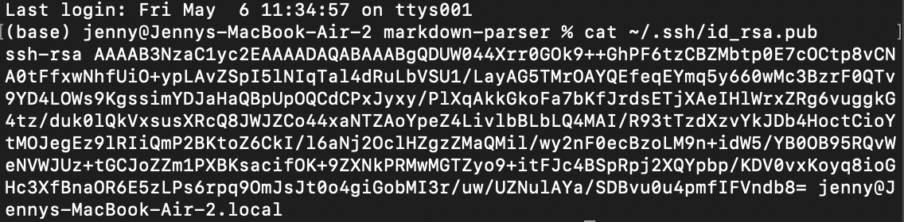
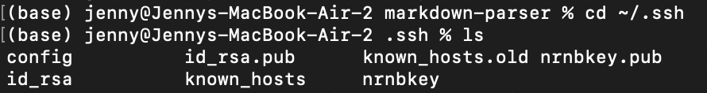
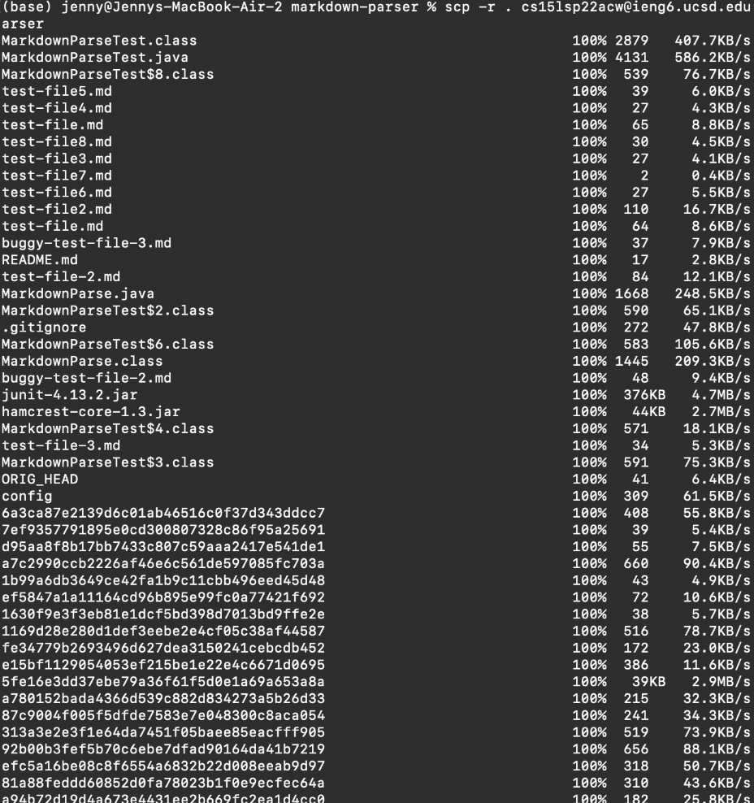
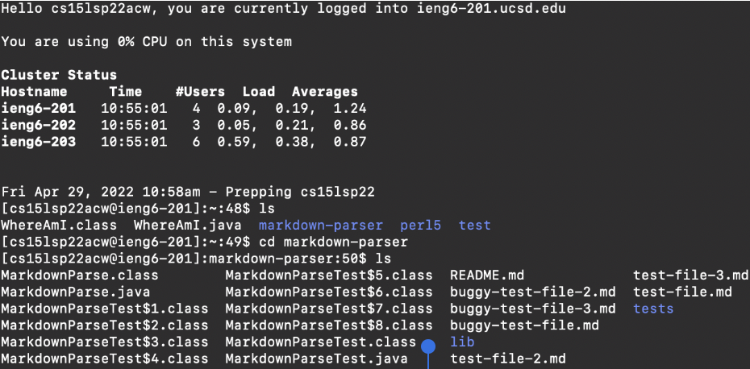

# Streamlining `ssh` Configuration

In `~/.ssh/config`, I added these lines using Vim in the command-line. To edit a file using Vim, I opened Vim using the command `vim ~/.ssh/config`, then typed `i` to insert text. After typing in the lines below, I pressed the escape key, then typed `:wq` to save and exit the file.

```
Host ieng6
	HostName ieng6.ucsd.edu
	User cs15lsp22acw
```


This allows me to access the ieng6 remote server by simply typing `ssh ieng6`.

```
(base) jenny@Jennys-MacBook-Air-2 ~ % ssh ieng6
Last login: Sun May  1 16:07:16 2022 from 128.54.209.194
============================ NOTICE =================================
Authorized use of this system is limited to password-authenticated
usernames which are issued to individuals and are for the sole use of
the person to whom they are issued.

Privacy notice: be aware that computer files, electronic mail and 
accounts are not private in an absolute sense.  You are responsible
for adhering to the ETS Acceptable Use Policies, which you can review at:
https://blink.ucsd.edu/faculty/instruction/tech-guide/policies/ets-acceptable-use-policies.html
=====================================================================

*** Problems, Suggestions, or Feedback ***
    
    For help requests, please create a ticket at:
    https://support.ucsd.edu/its 

    You may also report issues, suggestions, or feedback by e-mailing root on any system:
    mail -s "Your subject here" root
    Type your message - Ctrl+D to send
    
*** Access our Linux ssh terminals or remote desktops via a web browser at: ***
    https://linuxcloud.ucsd.edu

    All accounts must be enrolled in Duo for access. No VPN required.


-------------------------------------------------------

quota: No filesystem specified.
Hello cs15lsp22acw, you are currently logged into ieng6-203.ucsd.edu

You are using 0% CPU on this system

Cluster Status 
Hostname     Time    #Users  Load  Averages  
ieng6-201   11:30:01   14  4.37,   4.37,   4.60
ieng6-202   11:30:01   21  1.24,   0.74,   0.43
ieng6-203   11:30:02   15  16.70,  16.89,  16.63

 
Fri May 06, 2022 11:33am - Prepping cs15lsp22
[cs15lsp22acw@ieng6-203]:~:97$
```

To copy a file from my local machine to the remote server, I typed `scp test-file.md ieng6:~/`. Normally, I would have had to type my username `cs15lsp22zz@ieng6.ucsd.edu` in place of `ieng6`.

```
(base) jenny@Jennys-MacBook-Air-2 markdown-parser % scp test-file.md ieng6:~/
test-file.md                                  100%   64     1.4KB/s   00:00 
```

Using `ls` while logged into the remote server confirms that `test-file.md` was successfully copied over.

```
[cs15lsp22acw@ieng6-203]:~:97$ ls
WhereAmI.class  markdown-parser  skill-demo-2     test
WhereAmI.java   perl5            skill-demo-test  test-file.md
```

# Setting Up Github Access from `ieng6`

This is my public key on Github, which can be found in the "SSH and GPG" section of the Settings menu on Github.


On my local computer, the public key is stored as `~/.ssh/id_rsa.pub`.



My private key is stored in `~/.ssh` as `id_rsa`.



Then, on the remote server, I created a file called `delete-this-file.md` using `touch`, then committed and pushed my changes onto Github.

```
[cs15lsp22acw@ieng6-203]:markdown-parser:105$ touch delete-this-file.md
[cs15lsp22acw@ieng6-203]:markdown-parser:106$ git add .
[cs15lsp22acw@ieng6-203]:markdown-parser:107$ git commit -m "Created delete-this-file.md"
[main e91e5b9] Created delete-this-file.md
 Committer: Jenny Lam <cs15lsp22acw@ieng6-203.ucsd.edu>
Your name and email address were configured automatically based
on your username and hostname. Please check that they are accurate.
You can suppress this message by setting them explicitly. Run the
following command and follow the instructions in your editor to edit
your configuration file:

    git config --global --edit

After doing this, you may fix the identity used for this commit with:

    git commit --amend --reset-author

 1 file changed, 0 insertions(+), 0 deletions(-)
 create mode 100644 delete-this-file.md
[cs15lsp22acw@ieng6-203]:markdown-parser:108$ git push origin main
Username for 'https://github.com': srnq
Password for 'https://srnq@github.com': 
Enumerating objects: 4, done.
Counting objects: 100% (4/4), done.
Delta compression using up to 8 threads
Compressing objects: 100% (2/2), done.
Writing objects: 100% (3/3), 310 bytes | 5.00 KiB/s, done.
Total 3 (delta 1), reused 0 (delta 0), pack-reused 0
remote: Resolving deltas: 100% (1/1), completed with 1 local object.
To https://github.com/srnq/markdown-parser.git
   d014d98..e91e5b9  main -> main
```

Here's a [link](https://github.com/srnq/markdown-parser/commit/e91e5b9aa12631c9ac78c609da0cc8cb3a7b5169) to the resulting commit.

# Copying Whole Directories With `scp -r`

To copy a whole directory, such as `markdown-parser`, I used the command

```
$ scp -r . cs15lsp22acw@ieng6.ucsd.edu:~/markdown-parser
```



Here is me logging into the remote server and viewing the files I copied.



Then, I ran the JUnit tests on the remote server.

```
[cs15lsp22acw@ieng6-202]:markdown-parser:115$ javac -cp .:lib/junit-4.13.2.jar:lib/hamcrest-core-1.3.jar MarkdownParseTest.java
[cs15lsp22acw@ieng6-202]:markdown-parser:116$ java -cp .:lib/junit-4.13.2.jar:lib/hamcrest-core-1.3.jar org.junit.runner.JUnitCore MarkdownParseTest
JUnit version 4.13.2
............
Time: 0.299

OK (12 tests)

[cs15lsp22acw@ieng6-202]:markdown-parser:117$ 
```

To copy a directory and run tests on the remote server in one line, I used the following command:

```
(base) jenny@Jennys-MacBook-Air-2 markdown-parser % scp -r . ieng6:~/mdp; ssh ieng6 "cd mdp; /software/CSE/oracle-java-17/jdk-17.0.1/bin/javac -cp .:lib/junit-4.13.2.jar:lib/hamcrest-core-1.3.jar MarkdownParseTest.java; /software/CSE/oracle-java-17/jdk-17.0.1/bin/java -cp .:lib/junit-4.13.2.jar:lib/hamcrest-core-1.3.jar org.junit.runner.JUnitCore MarkdownParseTest"
```

I used `scp -r .` to copy the current directory over to `ieng6`, used a semicolon to write the next command on the same line, which is `ssh ieng6` to log in, then I wrote the commands to run the tests on `ieng6` in between quotation marks after `ssh ieng6` for it to be executed in the remote server.

I ran into some issues doing it in one line, but I followed a [post](https://piazza.com/class/l0lgl3r7ph370k?cid=444) on the CSE 15L Piazza that recommended I don't copy over any existing `.class` files in the client directory, and replace `javac` and `java` with `/software/CSE/oracle-java-17/jdk-17.0.1/bin/javac` and `/software/CSE/oracle-java-17/jdk-17.0.1/bin/java` respectively when running the JUnit commands and it worked smoothly. Apparently, this is due to the server using an older version of Java.

Output:

```
(base) jenny@Jennys-MacBook-Air-2 markdown-parser % scp -r . ieng6:~/mdp; ssh ieng6 "cd mdp; /software/CSE/oracle-java-17/jdk-17.0.1/bin/javac -cp .:lib/junit-4.13.2.jar:lib/hamcrest-core-1.3.jar MarkdownParseTest.java; /software/CSE/oracle-java-17/jdk-17.0.1/bin/java -cp .:lib/junit-4.13.2.jar:lib/hamcrest-core-1.3.jar org.junit.runner.JUnitCore MarkdownParseTest"

MarkdownParseTest.java                                  100% 4188   499.1KB/s   00:00    
mdparse                                                 100%   82     3.1KB/s   00:00    
delete-this-file.md                                     100%    0     0.0KB/s   00:00    
test-file5.md                                           100%   39     1.8KB/s   00:00    
test-file4.md                                           100%   27     2.0KB/s   00:00    
test-file.md                                            100%   65     1.4KB/s   00:00    
test-file8.md                                           100%   30     3.7KB/s   00:00    
test-file3.md                                           100%   27     0.9KB/s   00:00    
test-file7.md                                           100%    2     0.1KB/s   00:00    
test-file6.md                                           100%   27     0.7KB/s   00:00    
test-file2.md                                           100%  110     4.6KB/s   00:00    
test-file.md                                            100%   64     9.8KB/s   00:00    
buggy-test-file-3.md                                    100%   37     0.8KB/s   00:00    
README.md                                               100%   17     1.3KB/s   00:00    
test-file-2.md                                          100%   84     3.5KB/s   00:00    
MarkdownParse.java                                      100% 1668   227.8KB/s   00:00    
.gitignore                                              100%  272    42.1KB/s   00:00    
buggy-test-file-2.md                                    100%   48     2.0KB/s   00:00    
junit-4.13.2.jar                                        100%  376KB   1.4MB/s   00:00    
hamcrest-core-1.3.jar                                   100%   44KB   1.4MB/s   00:00    
test-file-3.md                                          100%   34     2.6KB/s   00:00    
ORIG_HEAD                                               100%   41     2.2KB/s   00:00    
config                                                  100%  309    16.1KB/s   00:00    
6a3ca87e2139d6c01ab46516c0f37d343ddcc7                  100%  408    38.2KB/s   00:00    
7ef9357791895e0cd300807328c86f95a25691                  100%   39     0.9KB/s   00:00    
b81fe22f1da9d9a4852ac761799abc81d80d0b                  100%  455    33.6KB/s   00:00    
d95aa8f8b17bb7433c807c59aaa2417e541de1                  100%   55     2.0KB/s   00:00    
a7c2990ccb2226af46e6c561de597085fc703a                  100%  660    48.0KB/s   00:00    
1b99a6db3649ce42fa1b9c11cbb496eed45d48                  100%   43     2.8KB/s   00:00    
ef5847a1a11164cd96b895e99fc0a77421f692                  100%   72     4.6KB/s   00:00    
1630f9e3f3eb81e1dcf5bd398d7013bd9ffe2e                  100%   38     1.4KB/s   00:00    
1169d28e280d1def3eebe2e4cf05c38af44587                  100%  516    41.8KB/s   00:00    
fe34779b2693496d627dea3150241cebcdb452                  100%  172     7.8KB/s   00:00    
e15bf1129054053ef215be1e22e4c6671d0695                  100%  386    65.7KB/s   00:00    
5fe16e3dd37ebe79a36f61f5d0e1a69a653a8a                  100%   39KB   1.6MB/s   00:00    
a780152bada4366d539c882d834273a5b26d33                  100%  215    15.5KB/s   00:00    
87c9004f005f5dfde7583e7e048300c8aca054                  100%  241     4.5KB/s   00:00    
313a3e2e3f1e64da7451f05baee85eacfff905                  100%  519    21.6KB/s   00:00    
92b00b3fef5b70c6ebe7dfad90164da41b7219                  100%  656    20.0KB/s   00:00    
efc5a16be08c8f6554a6832b22d008eeab9d97                  100%  318     7.7KB/s   00:00    
14d9864f0bf1ed3d2e195bc2d87bae6f898d97                  100%  198    12.2KB/s   00:00    
81a88feddd60852d0fa78023b1f0e9ecfec64a                  100%  310     9.2KB/s   00:00    
a94b72d19d4a673e4431ee2b669fc2ea1d4cc0                  100%  182     7.3KB/s   00:00    
7873f0fc07a74776993afc4c91ecf40df279ac                  100%  587    20.8KB/s   00:00    
d340c310da8cc02ba2eb0b26f64e464a91f465                  100%  272    15.9KB/s   00:00    
158fa0e8f5ff4cb4cd0894d84a7637f95e453a                  100%  454    22.0KB/s   00:00    
99683965deedbbbc47e7da65f9ae1f1ecb8e0f                  100%   39     2.5KB/s   00:00    
281544795a7a50582558ac9ce71c1bc9bfc633                  100%  203     4.6KB/s   00:00    
bf4c64ba9c5161e1b3d820112564fd569be44e                  100%  676    37.3KB/s   00:00    
eb038d185bd29287d3df9db1d61e983006cd3a                  100%   35     1.1KB/s   00:00    
e1f6ff38cbdf46d3681a539027e093c14513e6                  100%   43     2.4KB/s   00:00    
pack-c219e088539a204519cd1224b13f408ceda05633.idx       100% 1380    27.1KB/s   00:00    
pack-c219e088539a204519cd1224b13f408ceda05633.pack      100% 3236   312.1KB/s   00:00    
0031e615bbe2ae63b2748847839b4100a2267f                  100%  252    32.5KB/s   00:00    
f976984d31204d783c0235d046c37e529ffa64                  100%  361    23.6KB/s   00:00    
07e827c6470a2e6d74feb0f3be6744b56ed933                  100%  386    52.3KB/s   00:00    
c14c20490b10412d315084fded6f19fc93ef32                  100%  193    13.2KB/s   00:00    
a6d4ac960a8ff77d8c021188d808fa944fee94                  100%  337    28.8KB/s   00:00    
9ba9b30582a6ae82e858b5fa8cf209b885c3f9                  100%  387    57.4KB/s   00:00    
0a130f45cfe75a383bbde4c3255ed30b2b2c83                  100%  251    11.5KB/s   00:00    
47cbc257075f7906372cc1f64c09e48b8f563e                  100%   51     7.3KB/s   00:00    
77ee12f8b78c80d868800bb0ed9230589b20c3                  100%   91     6.7KB/s   00:00    
7f049571be3cd6c0cc385a24a766207483f22e                  100%  516    21.5KB/s   00:00    
78268ca93876cec0f094c2f221dc0e08ae7650                  100%  197     5.7KB/s   00:00    
70d146c58301a0c9160c9dbe9d00a24ee196af                  100%  338    26.1KB/s   00:00    
a9c85a282d25600bc83fe3f9d10ed0a070519f                  100%  415    11.0KB/s   00:00    
0eeaa99f7a685c0e8b43b08f4bd581f99d549b                  100%  226    15.3KB/s   00:00    
79a718b806b9a4d8b99e7221db26f56311aa92                  100%  103     7.6KB/s   00:00    
951e8b72a51539a05a9be6cc4a7b763c60000b                  100%  215     4.7KB/s   00:00    
467f5bbb2301d404a46e74d20f581feadb7e16                  100%  311    16.8KB/s   00:00    
1120f7610e5328208084d06ef7888e7dad0f3d                  100%  604    24.8KB/s   00:00    
15b407325ed759115263e71217dd5c605f2a68                  100%  199     5.6KB/s   00:00    
3728b578c2373f1fd981c8d15b4529afaeb7c7                  100%   43     3.7KB/s   00:00    
a55d8b8520dcc03c250a605151cc0d23a45518                  100%  328KB   2.4MB/s   00:00    
9e88c28e85c26256d0c874cd152d69192ce668                  100%  206     5.2KB/s   00:00    
f4a41951ad7658bf164dc1e3ebe1bd16cd046c                  100%  181     2.6KB/s   00:00    
f3872fae4085cd359ca5a75f9ae873ceac6cb3                  100%   45     2.2KB/s   00:00    
eda8aba97e33c8ce5338d84af78258d62b4905                  100%  416    11.5KB/s   00:00    
7f91acc7a85e3c549110f76cc3845911cd034d                  100%  677     6.1KB/s   00:00    
bfeb88a9296e2ced583b345d3dca99600c90ce                  100%  585    34.3KB/s   00:00    
398bc98bee81ff2f1ef175a3f434fce8ffaaf8                  100%  310    15.1KB/s   00:00    
c05add72e8c719bb81ca09d291a6f3dfb6bc70                  100%  251    19.8KB/s   00:00    
ea4d16bbdf6f5f1ce073ac51a1e2ded39c228d                  100%  177    21.2KB/s   00:00    
9de29bb2d1d6434b8b29ae775ad8c2e48c5391                  100%   15     0.4KB/s   00:00    
22e67665c1e3b4fd5a8bd58ec704df87a0f8c0                  100%  518    86.7KB/s   00:00    
1e5b9aa12631c9ac78c609da0cc8cb3a7b5169                  100%  184     4.8KB/s   00:00    
77f2df783b352f64b2adeaccd2485cbd534475                  100%   45     0.8KB/s   00:00    
a0ad3d2d82b37a5ca446e418fa38c5ecfde036                  100%  280     4.5KB/s   00:00    
966c66e0e881debbfb34376113888936e6bb4b                  100%  632    17.6KB/s   00:00    
8dc43e88f3ca6a3393992063c54c2c6208c540                  100%  766    18.1KB/s   00:00    
33083daec508879199179ca9a45a157fa713eb                  100%  193     6.3KB/s   00:00    
7f39e286cef6298eac696e52b1e5770a4d8cce                  100%  226    10.3KB/s   00:00    
996b74e4330e34c0bdbfa7e0805053b6f855c3                  100%  206     4.7KB/s   00:00    
acd1681979b7d1d22a9dc3c59194ae0ebb7830                  100%  661    35.4KB/s   00:00    
fac4addecd62ec3debd6e90cff40a669c82be1                  100%  109     3.2KB/s   00:00    
cc3d79f9a1707329b0e378349b72a5262a41e6                  100%  198     5.2KB/s   00:00    
f9c68a7b60785ae5b38a59c4cea4b30c84dba9                  100%   17     0.6KB/s   00:00    
865eca11fe57986d39af093434e9c9a9b1a4bf                  100%  573    16.7KB/s   00:00    
cff396f2731a85b420a079956e85bb4a6bd6d9                  100%  606    18.7KB/s   00:00    
70e0f8c70440b40f51910b769ba4673cdae327                  100%  193     4.5KB/s   00:00    
760ea0dfca26a3205592d5539930ba9a426c93                  100%   69     1.1KB/s   00:00    
3136da9b9b270a6f724a031c2aee1111a6bf3f                  100%  229     7.8KB/s   00:00    
d07127aed409b3eecf775324ff83798e94359e                  100%   44     0.7KB/s   00:00    
0cde404c0cea21f0d5c3b64b846c1ca89f90d1                  100%  521    72.1KB/s   00:00    
506426232f10fd80339697c43eacf7171547b8                  100%   46     1.6KB/s   00:00    
HEAD                                                    100%   21     0.6KB/s   00:00    
exclude                                                 100%  240     9.3KB/s   00:00    
HEAD                                                    100% 4647   203.7KB/s   00:00    
test                                                    100%  174     6.4KB/s   00:00    
main                                                    100% 4111   189.3KB/s   00:00    
HEAD                                                    100%  204     8.4KB/s   00:00    
main                                                    100% 2775   494.6KB/s   00:00    
description                                             100%   73     3.5KB/s   00:00    
commit-msg.sample                                       100%  896     2.8KB/s   00:00    
pre-rebase.sample                                       100% 4898   522.1KB/s   00:00    
pre-commit.sample                                       100% 1643    63.5KB/s   00:00    
applypatch-msg.sample                                   100%  478    25.8KB/s   00:00    
fsmonitor-watchman.sample                               100% 4655   303.7KB/s   00:00    
pre-receive.sample                                      100%  544    97.2KB/s   00:00    
prepare-commit-msg.sample                               100% 1492    84.4KB/s   00:00    
post-update.sample                                      100%  189    21.4KB/s   00:00    
pre-merge-commit.sample                                 100%  416    52.0KB/s   00:00    
pre-applypatch.sample                                   100%  424    22.9KB/s   00:00    
pre-push.sample                                         100% 1374    31.5KB/s   00:00    
update.sample                                           100% 3650   527.6KB/s   00:00    
push-to-checkout.sample                                 100% 2783   454.4KB/s   00:00    
test                                                    100%   41     2.5KB/s   00:00    
main                                                    100%   41     3.5KB/s   00:00    
HEAD                                                    100%   30     5.2KB/s   00:00    
main                                                    100%   41     4.0KB/s   00:00    
index                                                   100% 1996   267.4KB/s   00:00    
packed-refs                                             100%  112    12.6KB/s   00:00    
COMMIT_EDITMSG                                          100%   37     3.9KB/s   00:00    
FETCH_HEAD                                              100%   99     6.1KB/s   00:00    
buggy-test-file.md                                      100%   55     1.6KB/s   00:00    
JUnit version 4.13.2
............
Time: 0.093

OK (12 tests)

(base) jenny@Jennys-MacBook-Air-2 markdown-parser % 
```
