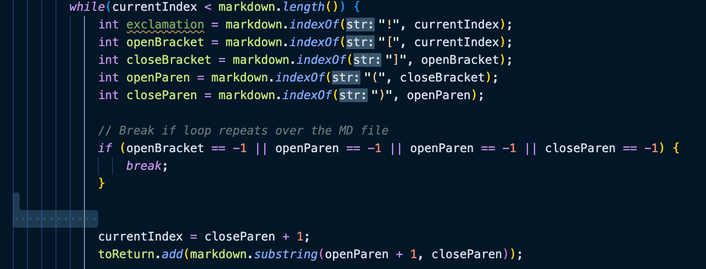

# Comparing Results

To find tests with different results I saved the results of my implementation and [their implementation](https://github.com/nidhidhamnani/markdown-parser/blob/main/MarkdownParse.java) in two different txt files, then compared them using `vimdiff`.

To do this, I ran this bash script:

```bash
for file in test-files/*.md;
do
  echo $file
  java MarkdownParse $file
done
```
on the provided implementation and saved it to `results.txt` by typing `bash script.sh > results.txt`. Then, I ran the same thing on my own implementation and saved it to `myResults.txt` using `bash script.sh > myResults.txt`. 

I used `vimdiff myResults.txt results.txt` to see the differences in the results of my implementation vs. their implementation.

# Examples of Different Results

## Example 1: `487.md`

Test file [487.md](https://github.com/nidhidhamnani/markdown-parser/blob/main/test-files/487.md) gave different results for the implementations. 

`487.md`:

```
[link](/my uri)
```

Expected: `[]`

My implementation: `[/my uri]` 

Their implementation `[]`

The VScode preview shows that there are no links and that their implementation is correct.

The problem is that if there are spaces within the parentheses, it should not be registered as a link, but my implementation does not check for the presence of spaces.



In the highlighted section, I can put an if-statement that checks whether there are spaces present in the text between the parentheses. If so, then I would not add it to the list of links.

## Example 2: `578.md`

Test file [578.md](https://github.com/nidhidhamnani/markdown-parser/blob/main/test-files/578.md) gave different results for the implementations. 

`578.md`:

```
My 
```

Expected: `[]`

My implementation: `[/path/to/train.jpg  "title"]`

Their implementation: `[]`

The VScode preview shows that there are no links and that their implementation is correct.

The problem with this is that my implementation thought that an image, which has the same format as a link in markdown except with an `!` in front, was a link. My implementation did not check for exclamation points. 


In the highlighted section, I can put an if-statement that checks where there is an exclamation mark before the first parentheses. If so, then the program would not consider it a link.
